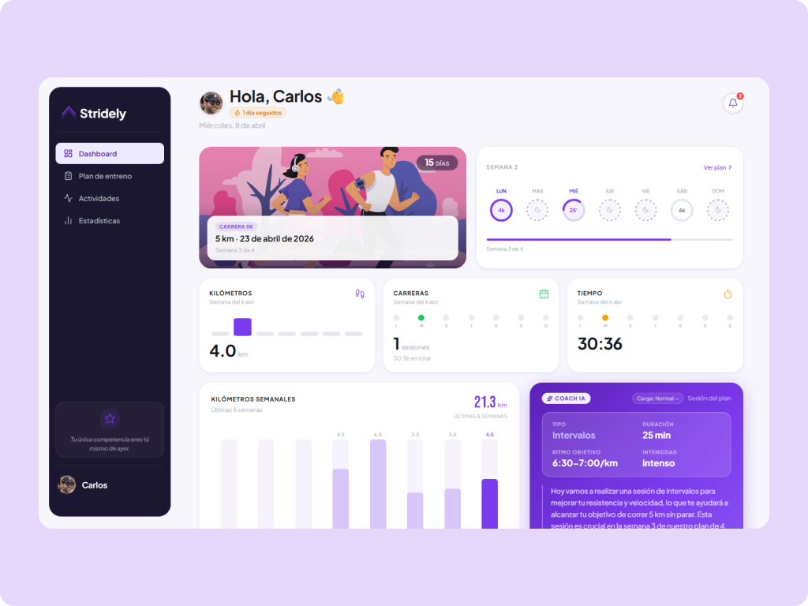
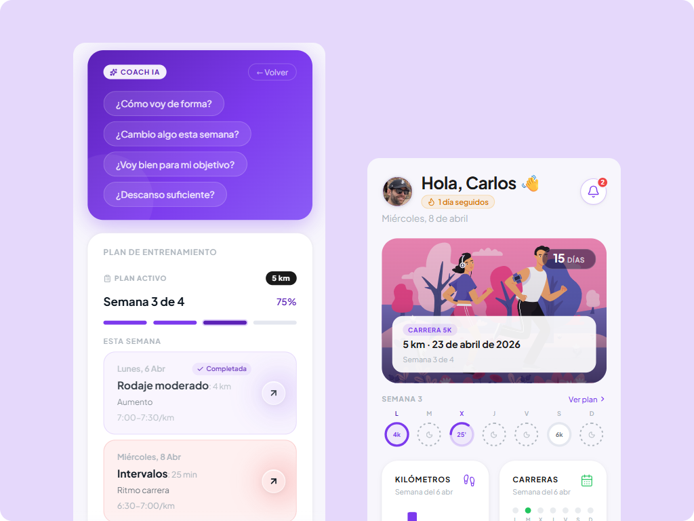

# Stridely

Aplicación web progresiva (PWA) de running que conecta con Strava, analiza tu historial de entrenamientos y te acompaña con un plan de entrenamiento personalizado asistido por IA.

<p align="center">
  
</p>

<p align="center">
  
</p>

---

## Índice

1. [Funcionalidades](#funcionalidades)
2. [Stack técnico](#stack-técnico)
3. [Estructura del proyecto](#estructura-del-proyecto)
4. [Páginas](#páginas)
5. [Componentes clave](#componentes-clave)
6. [Hooks y contexto](#hooks-y-contexto)
7. [API del servidor](#api-del-servidor)
8. [Flujo de datos](#flujo-de-datos)
9. [Variables de entorno](#variables-de-entorno)
10. [Desarrollo local](#desarrollo-local)

---

## Funcionalidades

### Autenticación
- Registro y login con email/password via **Supabase Auth**
- Rutas protegidas con `ProtectedRoute` — redirige a `/login` si no hay sesión

### Conexión con Strava
- OAuth 2.0 completo: el usuario autoriza desde la app, el servidor canjea el código por tokens
- Refresco automático de token cuando expira (cada 6 horas)
- **Webhook de Strava** — recibe eventos en tiempo real (nueva actividad) via `POST /api/strava/webhook` y lanza notificación push al atleta
- Actividades cargadas y normalizadas al tipo `Workout`
- Perfil del atleta (nombre, foto) mostrado en el sidebar

### Dashboard
- Saludo personalizado con nombre del atleta y fecha actual
- **Racha de días seguidos** — badge de fuego con días consecutivos de actividad
- **Hero card de carrera** — cuando hay plan activo con fecha de carrera: imagen de fondo, cuenta atrás en días, semana actual y barra de progreso del plan
- **Strip semanal** — mini calendario L–D con estado visual de cada sesión: pendiente / completada (✓) / hoy (resaltado) / descanso. Clic en sesión pendiente navega al detalle
- **Resumen semanal**: km, tiempo, salidas y desnivel de los últimos 7 días (con chart histórico de 8 semanas)

#### Coach IA + Plan — grid 2 columnas (desktop)
En desktop: Coach IA a la izquierda, Plan de entrenamiento a la derecha. En móvil: Coach IA primero, plan debajo.

**Coach IA**
- Recomendación diaria generada por Groq (Llama 3.3 70B) según historial reciente, cacheada en Supabase por día
- Si hay plan activo, muestra la sesión de hoy con tipo, duración, ritmo objetivo e intensidad
- **En desktop**: grid 2×2 con los 4 datos de la sesión (oculta el «Ritmo objetivo» si es null y pasa a 3 columnas)
- **En móvil**: fila compacta de pills `Tipo · Distancia · Ritmo` sin el grid completo; insight del coach truncado a 2 líneas
- **Indicador de carga** (Carga: Alta ↑ / Normal → / Baja ↓) calculado sobre últimos 7 días vs semana anterior
- **Alerta de patrones** — band amarilla descartable cuando los check-ins revelan fatiga o inconsistencia
- Tarjeta de sesión completada (🏆) si ya hay actividad Strava coincidente con la sesión de hoy
- Día de descanso con información de la siguiente sesión y días restantes
- Botón **Ver sesión completa** anclado al fondo de la card (con `margin-top: auto`) para rellenar el espacio en desktop

**Plan de entrenamiento (widget)**
- Semanas del plan con sesiones y estado de cada una
- Progreso del plan y enlace a la vista completa

#### Post-run check-in
- Detecta automáticamente la primera actividad del día (no repetible)
- Pregunta contextual sobre la sesión con chips de respuesta rápida
- Envía la respuesta al Coach IA y muestra un análisis breve personalizado

#### Notificaciones in-app
- Centro de notificaciones con badge de no leídas
- Avisos sobre sesiones pendientes, sesión completada, plan en riesgo, racha activa, progreso del plan, etc.

#### Meteorología
- **Card de tiempo** (última sección del dashboard): temperatura actual, condición del cielo, viento y pronóstico hora a hora con barras de probabilidad de lluvia
- **WeatherTip** (solo móvil, entre el strip semanal y la card Coach IA): aviso contextual de running si hay sesión ese día — «🌧 Llueve a las 19:00 h — sal antes de las 18:00», «☀️ 22°C · buenas condiciones para correr», etc.
- Datos via **Open-Meteo** (gratis, sin API key), posición vía `navigator.geolocation`
- Caché en memoria de 45 min en el servidor + caché de módulo 30 min en el cliente
- Si el usuario deniega la ubicación, la card no se muestra (fallo silencioso)

#### Banner motivacional
- Aparece cuando hay ≥ 2 sesiones del plan perdidas en la semana
- Mensaje diferenciado según número de sesiones perdidas

### Chat con el coach (sidebar)
- Conversación persistente con el Coach IA «Strider» accesible desde cualquier página
- Contexto completo: plan activo, actividades recientes y check-ins previos
- Historial de mensajes guardado en Supabase (`chat_messages`) por usuario
- El coach puede **mover sesiones** de la semana actual directamente desde el chat (petición en lenguaje natural → update en Supabase)
- Respuestas en streaming (texto progresivo)

### Actividades
- Grid de todas las actividades sincronizadas desde Strava
- Cada tarjeta: nombre, fecha, tipo (icono), distancia, tiempo y ritmo

### Detalle de actividad
- **Mapa interactivo** (Leaflet + CARTO Dark Matter) con polyline en color corporativo
- Métricas principales: distancia, tiempo, ritmo medio
- Métricas secundarias: desnivel, FC media/máx, cadencia, calorías
- Tabla de splits por kilómetro

### Plan de entrenamiento
- **Generación con IA** basada en objetivo, distancia, fecha de carrera, días/semana, km semanales actuales y longitud de tirada larga
- Periodización: fase base → fase específica → semana pico → taper → semana de carrera
- Plan guardado en Supabase (`training_plans`), un plan activo por usuario
- Sesiones marcadas automáticamente como **completadas** cuando hay actividad Strava coincidente (fecha ±1 d, duración ±30%)
- Vista hero con objetivo, fecha de carrera y progreso
- **Diagnóstico de plan** (banner en vista completa): el coach detecta sesiones perdidas y sugiere ajustes o alerta si el objetivo está en riesgo

### Detalle de sesión
- Hero con intensidad, tipo y número decorativo
- Stats: volumen y ritmo sugerido
- **Instrucciones pre-sesión** generadas por Coach IA: intro, calentamiento, parte principal, vuelta a la calma, ritmo objetivo y tiempo estimado (cacheado en `localStorage`)
- **Análisis post-entreno** cuando la sesión está completada: titular, resumen, bien hecho, a mejorar y valoración global comparando plan vs actividad real

### Estadísticas
- Selector de período: Esta semana / Este mes / Este año / Todo
- 4 KPIs: km totales, tiempo total, nº salidas, desnivel acumulado
- Barras semanales (últimas 12 semanas); barra ámbar si supera +10% la anterior
- Récords personales: mejor ritmo 5 km, mejor ritmo 10 km, carrera más larga, racha activa
- Gráfico de progresión de ritmo (SVG nativo)
- Distribución por tipo: run / trail / race
- Consistencia del plan: sesiones planificadas vs completadas

### Push Notifications (PWA)
- Suscripción/cancelación desde perfil
- Notificación matutina a las **08:00 (Madrid)** con la sesión del plan de hoy
- Notificación inmediata cuando Strava procesa una nueva actividad (via webhook)
- Implementado con **Web Push API + VAPID**

### Perfil
- Información del usuario y avatar
- Gestión de conexión con Strava (conectar / desconectar)
- Control de suscripción a push notifications
- Eliminación de cuenta (borra todos los datos via Supabase Admin API)

---

## Stack técnico

| Capa | Tecnología |
|------|------------|
| Frontend | React 19 + Vite + TypeScript 5 |
| Estilos | SCSS (BEM) con design tokens centralizados |
| Routing | React Router v7 |
| Mapas | Leaflet + React Leaflet + CARTO Dark Matter tiles |
| Auth | Supabase Auth (email/password) |
| Base de datos | Supabase (PostgreSQL) |
| Backend | Node.js + Express |
| IA | Groq API — Llama 3.3 70B Versatile |
| Strava | OAuth 2.0 + Strava API v3 + Webhook |
| Push | Web Push API + VAPID + node-cron |
| Meteorología | Open-Meteo (gratis, sin API key) |
| PWA | Service Worker (network-first) + Web App Manifest |
| Mobile | Capacitor (configurado para exportar iOS/Android) |
| Despliegue | GitHub → Vercel (frontend) |

---

## Estructura del proyecto

```
stridely/                          ← raíz del repo
├── stridely/                      ← frontend (React + Vite)
│   ├── public/
│   │   ├── sw.js                  ← Service Worker
│   │   └── manifest.json          ← Web App Manifest (PWA)
│   └── src/
│       ├── pages/                 ← una página = una ruta
│       ├── components/
│       │   ├── common/            ← AppSidebar, WeatherCard, ProtectedRoute
│       │   └── features/training/ ← TrainingPlan, MiniCalendar
│       ├── hooks/                 ← useStrava, usePushNotifications, useWeather
│       ├── context/               ← AuthContext, CoachChatContext
│       ├── services/              ← strava/client, supabase/client
│       ├── styles/                ← _tokens.scss, _mixins.scss, globals.scss
│       ├── types/                 ← Workout, ActivityDetail, etc.
│       └── utils/                 ← formatters (formatPace, formatDistance…)
└── server/
    └── index.js                   ← todos los endpoints API + cron
```

---

## Páginas

| Ruta | Archivo | Descripción |
|------|---------|-------------|
| `/login` | `Login.tsx` | Formulario de acceso |
| `/register` | `Register.tsx` | Registro de cuenta |
| `/auth/callback` | `AuthCallback.tsx` | Callback OAuth de Strava |
| `/dashboard` | `Dashboard.tsx` | Coach IA, plan, semana, actividades recientes, tiempo |
| `/activities` | `ActivitiesPage.tsx` | Grid de todas las actividades de Strava |
| `/activity/:id` | `ActivityDetail.tsx` | Detalle con mapa, métricas y splits |
| `/training-plan` | `TrainingPlanPage.tsx` | Plan de entrenamiento completo |
| `/training-plan/session/:planId/:week/:day` | `SessionDetailPage.tsx` | Instrucciones + análisis IA |
| `/stats` | `StatsPage.tsx` | Estadísticas, récords y progresión |
| `/profile` | `ProfilePage.tsx` | Perfil, Strava, push notifications |

---

## Componentes clave

### `AppSidebar` — `src/components/common/AppSidebar.tsx`
Sidebar de navegación. Logo, enlaces de navegación y botón de perfil con avatar. En móvil: barra fija en la parte inferior.

### `WeatherCard` / `WeatherTip` — `src/components/common/WeatherCard.tsx`
- `WeatherCard`: card completa con temperatura, condición, viento y pronóstico hora a hora
- `WeatherTip`: tira inline (solo móvil) con consejo de running contextual según el tiempo

### `TrainingPlan` — `src/components/features/training/TrainingPlan.tsx`
Uso dual (página completa + widget en Dashboard). Lógica de comparación plan↔actividad:
- `parsePlanDurationMin(session)` — duración objetivo en minutos
- `findMatchingActivity(session, week, plan, activities)` — busca actividad Strava por fecha (±1 d) y duración (±30%)
- `isSessionCompleted / isSessionMissed` — helpers booleanos

Exporta: `PlanSession`, `PlanWeek`, `StoredPlan`.

### `MiniCalendar` — `src/components/features/training/MiniCalendar.tsx`
Calendario semanal L–D con estado visual por sesión.

---

## Hooks y contexto

### `useStrava` — `src/hooks/useStrava.ts`
- `isConnected` — token activo en Supabase
- `activities: Workout[]` — actividades normalizadas
- `athleteData` — perfil del atleta
- `fetchActivities()` — carga desde servidor, refresca token si expirado

### `useWeather` — `src/hooks/useWeather.ts`
- Solicita posición con `navigator.geolocation` (caché 30 min de módulo)
- Llama a `GET /api/weather` (proxy al servidor con caché 45 min)
- Exporta helpers: `wmoIcon(code)`, `wmoLabel(code)`, `getRunningTip(weather)`
- Falla silenciosamente si el usuario deniega la ubicación

### `usePushNotifications` — `src/hooks/usePushNotifications.ts`
- `status: 'unsupported' | 'denied' | 'subscribed' | 'unsubscribed'`
- `subscribe(athleteId?, todaySession?)` — solicita permiso y registra suscripción VAPID
- `unsubscribe()` — cancela suscripción

### `AuthContext` — `src/context/AuthContext.tsx`
Provee `{ user, loading }` a toda la app. Utilizado por `ProtectedRoute`.

### `CoachChatContext` — `src/context/CoachChatContext.tsx`
Estado global del chat lateral: mensajes, estado de apertura/cierre, `planModifiedAt` para refrescar el plan cuando el coach mueve sesiones.

---

## API del servidor

Base URL: `http://localhost:3001` (dev) / `VITE_API_URL` en producción.

### Strava

| Método | Ruta | Descripción |
|--------|------|--------------|
| GET | `/health` | Healthcheck |
| POST | `/api/strava/token` | Canjea código OAuth por tokens |
| POST | `/api/strava/refresh` | Refresca el access token |
| GET | `/api/strava/activities` | Lista actividades (`?page=&per_page=`) |
| GET | `/api/strava/activities/:id` | Detalle de una actividad |
| GET | `/api/strava/athlete` | Perfil del atleta |
| GET | `/api/strava/webhook` | Verificación del webhook |
| POST | `/api/strava/webhook` | Receptor de eventos en tiempo real |

### Coach IA

| Método | Ruta | Descripción |
|--------|------|--------------|
| POST | `/api/ai/recommend` | Recomendación diaria (Dashboard) |
| POST | `/api/ai/training-plan` | Genera plan de entrenamiento completo |
| POST | `/api/ai/session-detail` | Instrucciones pre-sesión |
| POST | `/api/ai/session-review` | Análisis post-entreno (plan vs actividad real) |
| POST | `/api/ai/post-run-checkin` | Respuesta al check-in post-carrera |
| POST | `/api/ai/pattern-alert` | Detecta patrones de carga o inconsistencia |
| POST | `/api/ai/coach-question` | Responde preguntas rápidas del usuario |
| POST | `/api/ai/plan-adjust` | Diagnóstico y ajuste del plan activo |
| POST | `/api/ai/coach-chat` | Chat conversacional con el coach (historial en Supabase, puede mover sesiones) |

### Meteorología

| Método | Ruta | Descripción |
|--------|------|--------------|
| GET | `/api/weather` | Tiempo actual + pronóstico horario (`?lat=&lon=`), proxy a Open-Meteo con caché 45 min |

### Push Notifications

| Método | Ruta | Descripción |
|--------|------|--------------|
| GET | `/api/push/vapid-key` | Devuelve la clave pública VAPID |
| POST | `/api/push/subscribe` | Registra suscripción push |
| POST | `/api/push/unsubscribe` | Cancela suscripción push |
| POST | `/api/push/test` | Notificación de prueba |
| POST | `/api/cron/morning-push` | Endpoint HTTP para cron externo (cron-job.org) |

### Cuenta

| Método | Ruta | Descripción |
|--------|------|--------------|
| DELETE | `/api/account` | Elimina la cuenta del usuario autenticado |

**Cron:** a las **08:00 Madrid** (06:00 UTC) el servidor envía notificación matutina con la sesión del plan. En Vercel (serverless) se usa el endpoint HTTP protegido con `CRON_SECRET`.

---

## Flujo de datos

```
Usuario
  │
  ├─ Auth (Supabase) ──────────────► AuthContext → ProtectedRoute
  │
  ├─ Strava OAuth
  │    └─ /auth/callback → POST /api/strava/token → tokens en Supabase
  │
  ├─ useStrava
  │    ├─ Lee tokens de Supabase (refresca si expirado)
  │    └─ GET /api/strava/activities → Workout[]
  │
  ├─ useWeather
  │    ├─ navigator.geolocation → lat/lon
  │    └─ GET /api/weather → Open-Meteo (caché 45 min servidor)
  │
  ├─ Plan de entrenamiento
  │    ├─ POST /api/ai/training-plan → JSON estructurado
  │    └─ Guardado en Supabase (training_plans)
  │
  ├─ Análisis IA (cacheados en localStorage o Supabase)
  │    ├─ POST /api/ai/recommend       → consejo diario (caché Supabase/día)
  │    ├─ POST /api/ai/session-detail  → instrucciones pre-sesión (localStorage)
  │    ├─ POST /api/ai/session-review  → análisis post-entreno (localStorage)
  │    ├─ POST /api/ai/post-run-checkin → check-in tras carrera
  │    ├─ POST /api/ai/pattern-alert   → alerta de patrones (localStorage/día)
  │    ├─ POST /api/ai/coach-question  → pregunta libre al coach
  │    ├─ POST /api/ai/plan-adjust     → diagnóstico del plan
  │    └─ POST /api/ai/coach-chat      → chat con historial (Supabase)
  │
  └─ Push Notifications
       ├─ usePushNotifications → POST /api/push/subscribe (VAPID)
       ├─ Cron 08:00 → webpush a todos los suscriptores con sesión del día
       └─ Strava Webhook → push inmediato al atleta al registrar actividad
```

---

## Variables de entorno

**`stridely/.env.local`**
```env
VITE_SUPABASE_URL=https://xxxx.supabase.co
VITE_SUPABASE_ANON_KEY=eyJ...
VITE_STRAVA_CLIENT_ID=12345
VITE_API_URL=http://localhost:3001
```

**`server/.env`**
```env
STRAVA_CLIENT_ID=12345
STRAVA_CLIENT_SECRET=xxxx
GROQ_API_KEY=gsk_...
SUPABASE_URL=https://xxxx.supabase.co
SUPABASE_SERVICE_ROLE_KEY=eyJ...
VAPID_PUBLIC_KEY=BM...
VAPID_PRIVATE_KEY=xxxx
VAPID_SUBJECT=mailto:hola@stridely.app
CRON_SECRET=tu-secreto-para-el-cron
ALLOWED_ORIGINS=https://stridely.app,https://www.stridely.app
PORT=3001
```

> Sin las variables VAPID el servidor arranca igual pero las push notifications quedan desactivadas (aviso en consola).  
> `CRON_SECRET` protege el endpoint `/api/cron/morning-push` de llamadas no autorizadas.  
> `ALLOWED_ORIGINS` restringe CORS en producción. En desarrollo puede omitirse.

---

## Desarrollo local

```bash
# Terminal 1 — Servidor Express
cd server && npm install && npm run dev   # http://localhost:3001

# Terminal 2 — Frontend React
cd stridely && npm install && npm run dev # http://localhost:5173
```

**Deploy:**
```bash
git add -A
git commit -m "feat: ..."
git push origin develop
git checkout main && git merge develop --no-edit && git push origin main
git checkout develop
```

